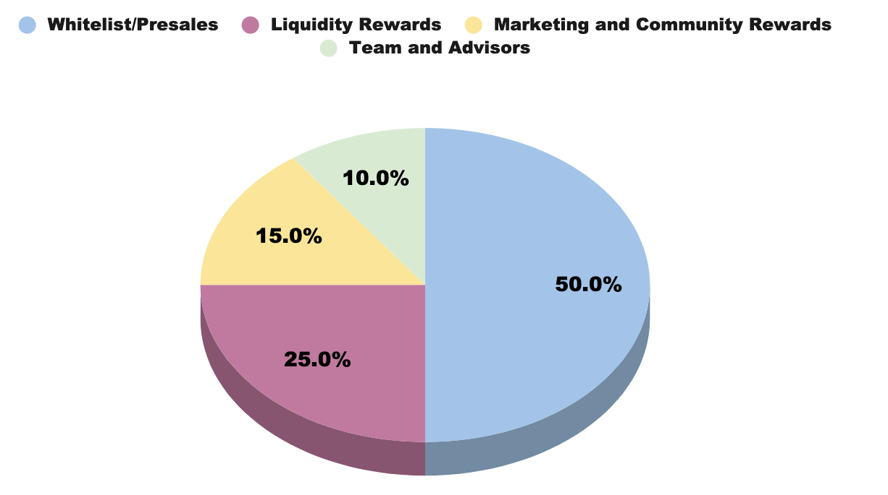

 
SPORK is the ecosystem’s native ERC-20 token and will be used for incentives, governance, project development, swaps and token burns. As for investors and liquidity providers, the SPORK token’s ownership makes them eligible for a range of use-cases.

## Use Cases

The SPORK token has several use-cases within the Spork ecosystem:
 
* Additional Benefits: Investors holding Spork tokens get additional benefits and better swap ratios for pools running on the platform, as outlined in the previous sections.

* Governance: The Spork platform will implement a regular Proof of Stake (PoS) consensus mechanism, enabling SPORK holders to gain voting rights by staking their tokens in designated wallets. In general, the mechanism will involve limited-period staking, to be defined in detail at the time of the platform’s governance launch. In the spirit of fair value and democracy, staking votes will yield rewards based on weight, but 1 vote per staker will be strictly enforced so the protocol is not dominated by larger holders.

* Staking: Spork token holders will be able to generate annual passive income from their SPORK tokens, simply by holding their tokens in specific ERC20 wallets. Periodically there will be staking pools where Sporks may stake their SPORK tokens in Farming Pools to receive additional rewards on top of the dividend tax fees. 

* LP Pools: Sporks that provide SPORK tokens via specific liquidity pools (Uniswap, 1Inch, etc.) will have the chance to gain additional rewards, on top of staking rewards generated from dividend tax fees. Simply add liquidity to the specific pool and stake your LP tokens in the corresponding farm.

* Transactions Fees (Dividends, YE Bonus, Burn): Spork token transactions automatically apply a 12% tax for purchase and sales. This tax is collected to incentivise holders with dividend payments on transactions. It is also implemented to prevent front runner bots from abusing our system. 10% is paid out to all holders, while 1% is sent to the year-end Bonus contract, 0.5% sent to reserve and 0.5% is burnt to create deflation. Users that stake their tokens in contracts or simply hold in their wallet will automatically receive all rewards, anywhere tokens are kept.

* Token Burn/Burn Swap: Spork will adopt periodic token burns to increase the value and scarcity in Spork token as popularity grows. Spork will also include a Burn Swap for future projects where users will be able to swap SPORK for an allotted amount of tokens of upcoming projects. This will allow users to swap to new tokens without impacting the price of SPORK negatively. All SPORK tokens swapped will be burnt.

* Reserve: This reserve are tokens allocated for future initiatives and to support the community, marketing, exchanges fees ,and long term liquidity.

## Token Sale Metrics

 
> Total Supply: 100,000,000 Spork (Deflationary to 10,000,000)

* Whitelist Sale: 10,000,000 
    * 1 ETH = 40,000 SPORK ($.04pu)* 
    * 250 ETH MAX (Unsold tokens will be available to public sale)
    * Limit on purchase: 25 ETH max (may change based on registrations)

* Public Sale: 40,000,000
    * 1 ETH = 35,555 SPORK ($.045pu)* 
    * 1,125 ETH MAX (Not including unsold whitelist tokens)
    * Limit on purchase: None

* LP/Staking/Vesting: 15,000,000    
    * - X/Timelock(Double to Triple Rewards) 
    * - X/Flexible(Low Reward)

* Development: 25,000,000
    * 10% Timelocked: 3mo
    * 15% Timelocked: 6mo
    * 25% Timelocked: 1yr 
    * 50% Timelocked: 2yr 

* Team and Advisors: 10,000,000
    * 10% Timelocked: 3mo
    * 15% Timelocked: 6mo
    * 25% Timelocked: 1yr 
    * 50% Timelocked: 2yr 

* Listing Price: 1 ETH = 32,000 SPORK ($.05pu)*
*Prices to reflect USD value and will adjust ETH price accordingly via smart contract.
 
 
 
## Token Allocation & Circulation
#### Whitelist/ Public Sale ####
50,000,000 Spork (50%) will be allocated for pre-sales. Sales will happen in a 2 week window with the first phase commencing week 1 and second phase of sale during week 2. All unsold tokens will be burnt. 75% of presale ETH will go to liquidity. Listing will happen on Uniswap shortly after presale Hardcap is reached or timer concludes. Softcap will be 75 ETH and Hardcap is 1,375 ETH (Assuming all tokens are sold in whitelist/public sales).

 
#### Staking (LP/Timelock/Staking) Rewards ####
25,000,000 Spork (25%) will be allocated as staking rewards, to be circulated in the form of Average Annual Yields (AAY) Spork holders who stake their tokens in a compatible farm will be eligible for these rewards. Rewards will come into circulation over a period of 10 years, with a maximum capping of 2,500,000 tokens per year.
 
#### Marketing, Development, and Community Rewards ####
15,000,000 Spork (15%) tokens are allocated for future initiatives, airdrops/rewards for the community, liquidity provisions, and development of the protocol. The fund’s allocation will be disbursed in various (%), after a lock-in period starting at 3 months to 2 year. 

 
#### Team & Advisors #### 
10,000,000 SPORK (10%) will be allocated for incentivizing the Spork team and its advisors. The team’s allocation will be disbursed in various (%), after a lock-in period starting at 3 months to 2 year. Advisors will receive their allocation similarly, but after 6 months of lock-in.
